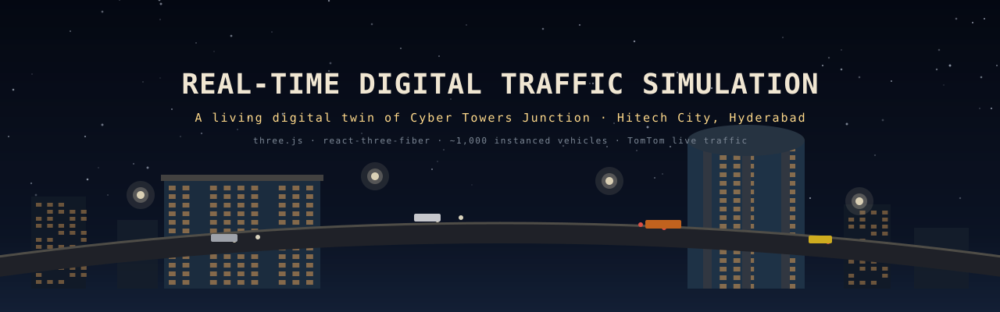
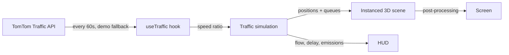
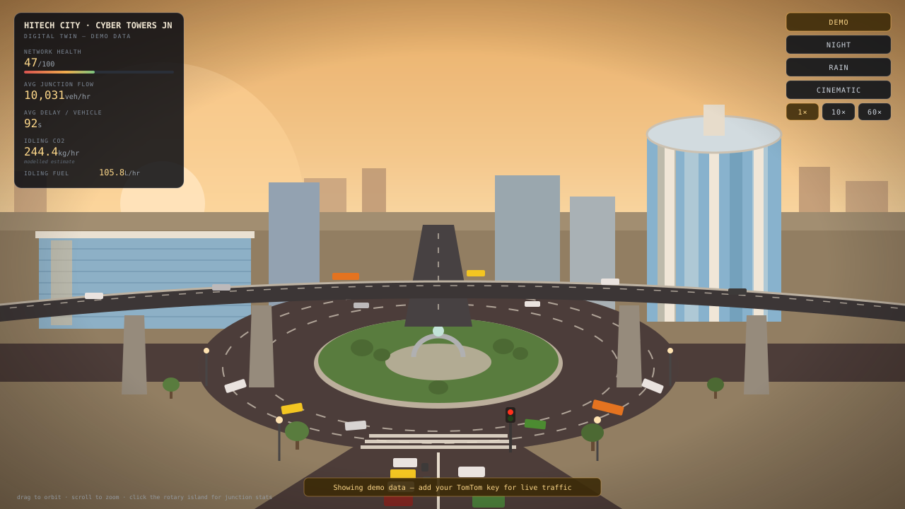
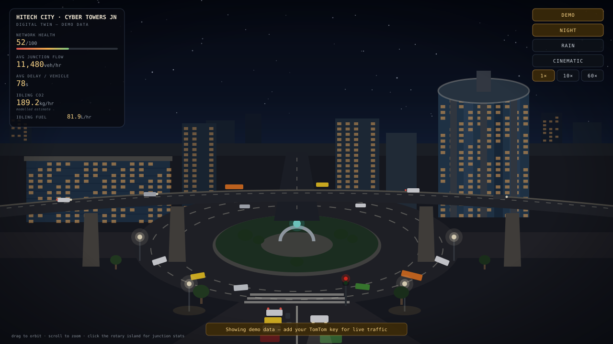
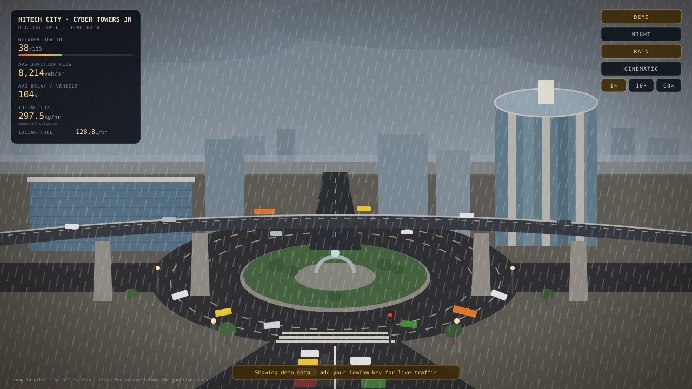

# Real-Time Digital Traffic Simulation

A 3D digital twin of the Cyber Towers junction in Hitech City, Hyderabad,
running in the browser. I built it to explore what a "living" traffic dashboard
could look like: instead of a top-down map with colored lines, you get a
cinematic street-level view of a signalised four-arm junction with its central
rotary, the E-W flyover passing over it, and the glass IT-corridor skyline —
including a stylised cylindrical Cyber Towers — with about 1,000 simulated
vehicles (cars, auto-rickshaws, buses, two-wheelers) queuing at signals while
flyover traffic sails over the jam. Live congestion data from the TomTom
Traffic API drives how fast the network moves and how red the roads look.

(The `main` branch holds the original Connaught Place, New Delhi version of
this scene; this branch remodels it for Hitech City.)

Stack: Vite + React + Three.js (`three`, `@react-three/fiber`,
`@react-three/drei`, `@react-three/postprocessing`).



## How it works

Every 60 seconds the app asks TomTom how fast traffic is actually moving at
the junction. That one number (current speed vs free-flow speed) throttles
all ~1,000 simulated vehicles, which queue at signals and follow each other
using a simple car-following model. The renderer draws them as instanced
meshes so the whole thing stays at 60fps, and the HUD reads its metrics back
out of the running simulation.



## Running it

```bash
npm install
npm run dev
```

Open the printed URL (usually http://localhost:5173). With no API key it runs in
demo mode with baked traffic data and a small banner saying so — nothing is
broken, it's just not live.

For live data, get a free key from https://developer.tomtom.com/ (Traffic Flow
API), copy `.env.example` to `.env`, set `VITE_TOMTOM_KEY`, and restart the dev
server. The app then fetches flow data for the junction every 60 seconds and
uses the current-speed / free-flow ratio to drive vehicle speeds and road
color. Any fetch failure silently falls back to demo mode; live readings are
fetched, rendered, and discarded, never stored.

## What you can do

Drag to orbit and scroll to zoom (the camera never goes top-down). Toggle
Cinematic for a slow automatic orbit, Night for streetlights, headlights and
window glows, Rain for particle rain and wet reflective roads. Sim speed runs
at 1×, 10×, or 60×. Clicking the rotary island opens a panel comparing live
speed against free-flow speed alongside the simulation's own stats. The HUD
shows network health, junction flow, average delay, and idling CO₂/fuel.

## Honest caveats

The geometry is stylized, not surveyed — the rotary radius, flyover profile,
and tower placement are eyeballed from maps and photos of the junction. The traffic model is a
simple car-following model with fixed signal cycles, good enough to make
congestion look and behave plausibly, not for engineering conclusions. The
CO₂ and fuel figures are modelled estimates (0.75 L/hr per idling vehicle,
2.31 kg CO₂ per litre), and TomTom's flow segment covers one road segment
near the junction point, which I apply to the whole network. Treat everything
quantitative as illustrative.

## Adapting it to another junction

`src/config.js` holds the city, junction name, and coordinates (the TomTom
feed follows the coordinates automatically), plus all the visual tunables:
bloom strength, sun angle, fog density, vehicle density, ring radii, signal
cycle. The lane network lives in `src/sim/lanes.js` and the scenery in
`src/scene/` — the rotary-plus-flyover layout is baked in there, so a different
road layout means rewriting those two places (compare this branch against
`main` to see exactly what a re-skin touches).

## Layout

```
src/
  config.js            # all tunables
  sim/lanes.js         # rotary/arm/flyover lane geometry + signal phases
  sim/simulation.js    # car-following traffic model (substepped, 60x-stable)
  data/useTraffic.js   # TomTom fetch + demo fallback (never blocks the UI)
  scene/               # roads, arcades, furniture, vehicles, rain, post-fx
  ui/HUD.jsx           # docked monospace HUD
```

## What it looks like

| Golden hour | Night | Rain |
| --- | --- | --- |
|  |  |  |

These previews are illustrative SVG mockups generated by
`docs/generate-screens.mjs` from the app's actual palette, HUD layout and
scene composition — not captures of a live run. I'll swap in real
screenshots once I grab them; until then, treat these as a faithful sketch
of what `npm run dev` gives you.

## Roadmap

Done so far: the full 3D junction with rotary, arms and flyover; ~1,000
instanced vehicles with signal queuing; TomTom live data with demo fallback;
night, rain, cinematic and sim-speed modes; the HUD with modelled emissions.

Where I want to take it next, roughly in order:

- [ ] Turning movements — vehicles actually leaving the rotary onto arms and
      vice versa, instead of staying on closed loops
- [ ] Real road geometry imported from OpenStreetMap so a new junction doesn't
      mean hand-writing lanes
- [ ] Per-arm TomTom flow segments (one probe per approach road) instead of a
      single segment applied to the whole network
- [ ] Adaptive signal timing that responds to queue lengths, with a
      before/after delay comparison in the HUD
- [ ] Pedestrians on the zebra crossings
- [ ] Historical playback — record a day of readings and scrub through it

## License

MIT — see [LICENSE](LICENSE).
